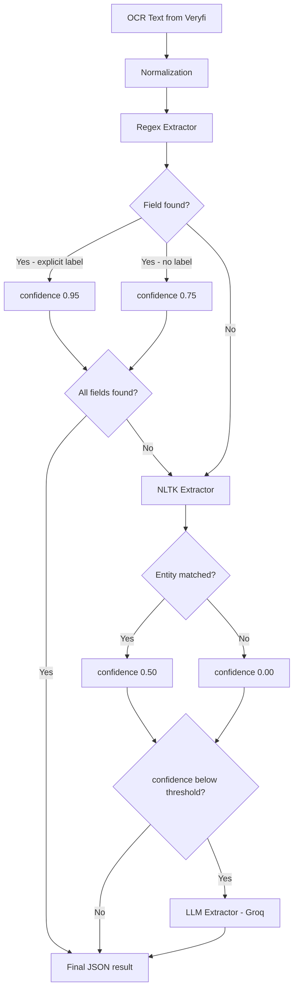

# ParseFlow

ParseFlow is a document intelligence system built as a technical test for the Data Annotations Engineer role at Veryfi. It transforms invoice documents into structured JSON data by combining Veryfi's OCR API with a multi-layer extraction pipeline.

---

## Overview

The system receives an invoice as a file or URL, sends it to the Veryfi OCR API to obtain the raw text, and then applies three extraction strategies in sequence to produce a structured JSON output with the following fields:

- Vendor name
- Vendor address
- Bill to (customer name)
- Invoice number
- Date
- Line items (description, quantity, unit price, total, tax rate, SKU)

---

## Extraction approach

The extraction pipeline uses three strategies that degrade gracefully:



**1. Regex extractor**
The primary strategy. Uses regular expressions to detect fields based on structural patterns and explicit labels in the OCR text (e.g. `Invoice No.`, `Bill To:`, `Invoice Date`). Fields extracted with an explicit label receive a confidence score of 0.95. Fields inferred from position or pattern without a label receive 0.75.

**2. NLTK extractor (NLP fallback)**
If a field is not found by regex, the NLTK Named Entity Recognition model attempts to extract it. It maps entity types to fields: `ORGANIZATION` to vendor name, `GPE` to vendor address, `PERSON` to bill to. Fields extracted by NLTK receive a confidence score of 0.50.

**3. LLM extractor (Groq / Llama 4 Scout)**
If a field is still missing or has a confidence score of 0.50 or below after the previous two strategies, the system calls the Groq API with Llama 4 Scout to extract the remaining fields from the full OCR text. This is the most capable strategy but also the most expensive in terms of latency and API usage, so it is only invoked when necessary.

---

## Assumptions

- Documents are in English. Spanish or other languages are not supported by the current regex patterns.
- The Veryfi OCR API provides a usable `ocr_text` field. The system does not perform its own OCR.
- Vendor names embedded in logos may not be extracted correctly, as the OCR captures logo text before the structured vendor name.
- Documents without at least two of the keywords `invoice`, `total`, or `date` are rejected as unsupported.
- Latency is directly affected by two external dependencies. The Veryfi OCR API adds network latency on every request since the document must be sent and processed remotely. If the LLM extractor is invoked, a second external call to the Groq API adds additional latency. For documents where regex and NLTK extract all fields successfully, the LLM is not called and latency remains low.
- Regex patterns are the first line of extraction and provide deterministic, low-latency results. However, they require continuous adjustment as new invoice formats are encountered. Each new layout may introduce edge cases — different label names, column orders, address formats, or OCR artifacts — that require adding or refining patterns. This is an inherent limitation of rule-based extraction and the primary reason the NLTK and LLM fallbacks exist.

## Document exclusion

The system rejects documents that do not match the expected invoice format. To validate this behavior, a public grocery receipt (`receipt_public.jpg`) was used as a test document. The receipt does not contain the keywords `invoice`, `total`, and `date` in sufficient quantity, so the validation step rejects it before extraction begins.

To test exclusion:

```bash
python run.py --file assets/receipt_public.jpg
```

The system will return: `Error: Unsupported document type`

---

## Project structure

The project follows Clean Architecture with four layers:

- **Domain** — data models (`ExtractedField`, `ExtractionResult`, `LineItem`)
- **Application** — extraction pipeline, normalization, validation, confidence scoring
- **Infrastructure** — Veryfi OCR provider
- **Presentation** — FastAPI REST API and request/response schemas

The architecture is designed to support extensibility. New extraction strategies can be added by implementing the `BaseExtractor` interface without modifying the existing pipeline. The current system includes three extractors — regex, NLTK, and LLM — and additional ones can be plugged in following the same pattern.

```
app/
├── domain/
│   └── models/
│       ├── extracted_field.py
│       ├── extraction_result.py
│       └── line_item.py
├── applications/
│   ├── services/
│   │   └── process_document.py
│   └── use_cases/
│       ├── confidence_service.py
│       ├── normalization_service.py
│       ├── validation_service.py
│       └── extractors/
│           ├── base_extractor.py
│           ├── regex/
│           │   └── regex_extractor.py
│           ├── NPL/
│           │   └── npl_extractor.py
│           └── LLM/
│               └── LLMExtractor.py
├── infrastructure/
│   └── ocr/
│       └── veryfi_provider.py
└── presentation/
    ├── api/
    │   ├── dependencies.py
    │   └── routes/
    │       └── processing.py
    └── schemas/
        ├── request_schema.py
        └── response_schema.py
```

The synchronous architecture was chosen to prioritize simplicity and low latency over the complexity of an asynchronous pipeline with queues and workers. This decision is documented in the ADR.

---

## Deployment

The backend is deployed on Render as a Web Service and is publicly accessible. The frontend is deployed on Vercel.

- Backend: deployed on Render (FastAPI + Uvicorn)
- Frontend: https://parseflow-frontend.vercel.app

The API accepts requests from both `http://localhost:3000` (local development) and the Vercel frontend URL.

---

## Installation

**Requirements:** Python 3.9+

```bash
git clone <repository-url>
cd Veryfi
python -m venv .venv
source .venv/bin/activate
pip install -r requirements.txt
```

Copy the environment template and fill in your credentials:

```bash
cp .env_template .env
```

Required environment variables:

```
VERYFI_API_KEY=
VERYFI_USERNAME=
VERYFI_CLIENT_ID=
VERYFI_CLIENT_SECRET=
GROQ_API_KEY=
```

---

## Usage

**Run the API server:**

```bash
fastapi dev main.py
```

**Process a document from the command line:**

```bash
# From a local file
python run.py --file path/to/invoice.pdf

# From a URL
python run.py --url https://example.com/invoice.pdf
```

Note: on the first run, NLTK will automatically download the required language models. This requires an internet connection and takes a few seconds. Subsequent runs are immediate.

If `GROQ_API_KEY` is not configured, the system will still work using regex and NLTK extraction only. The LLM fallback will be skipped silently.

**Run the tests:**

```bash
pytest tests/ --cov=app --cov-report=term-missing -v
```

---

## Good practices implemented

- Clean Architecture with strict layer separation
- `BaseExtractor` interface for extensibility — new extraction strategies can be added without modifying the pipeline
- `ConfidenceService` with scores tied to extraction source rather than arbitrary hardcoded values
- Input validation with Pydantic — file extensions, URL vs base64, mutually exclusive fields
- Unit tests with 93% coverage
- Environment variables for all credentials — no secrets in code
- Unsupported document detection — the system rejects non-invoice documents before attempting extraction
